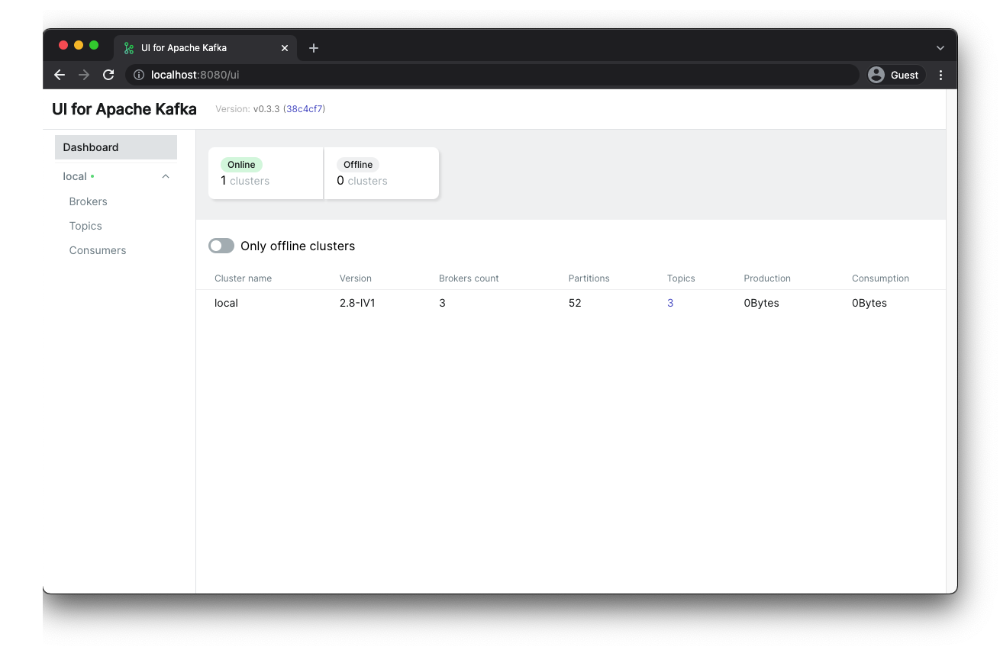
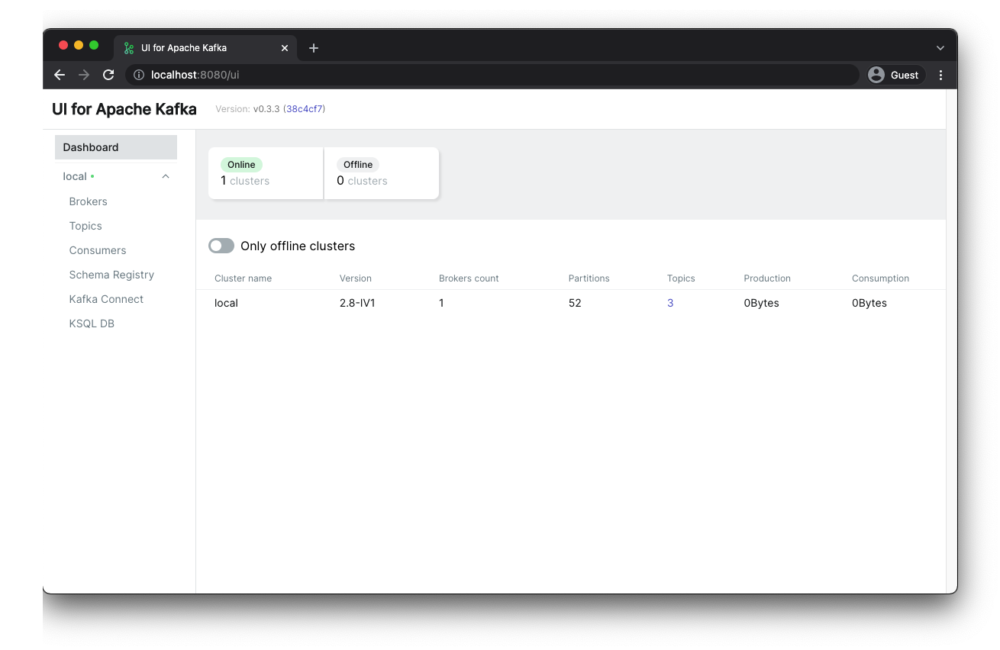

## Local Kafka Setup with Docker Compose

### cluster.yml

#### Stacks
- Single Zookeeper
- 3 Kafka Brokers
- UI for Apache Kafka

#### Execution

- Docker Compose

```sh
$ docker-compose -f cluster.yml up
```

- UI for Apache Kafka: http://localhost:8080



### full-stack.yml

#### Stacks
- Single Zookeeper
- Single Kafka Brokers
- Schema Registry
- Kafka Connect
- KSQL Server
- UI for Apache Kafka

#### Execution

- Docker Compose

```sh
$ docker-compose -f full-stack.yml up
```

- UI for Apache Kafka: http://localhost:8080



## References

### kafka-stack-docker-compose

https://github.com/conduktor/kafka-stack-docker-compose

You can choose various kinds of Kafka Stack using Docker compose.

### UI for Apache Kafka

https://github.com/provectus/kafka-ui

Open source Kafka management tool based on Web UI.