# AdminBro로 Nest.js admin 쉽게 만들기


개발을 할 때 따로 Admin 까지 개발해야한다는 것은 할 일이 많은 개발자들에게 부담이 되곤 하는데, Django framework 같은 경우 강력한 [admin site](https://docs.djangoproject.com/en/3.1/ref/contrib/admin/) 기능을 제공하여 개발자들의 부담을 줄여준다.

우연히 [AdminBro](https://softwarebrothers.github.io/admin-bro-dev/)라는 Node.js 애플리케이션용 어드민 자동화 툴을 발견하였는데,
기존에 존재하는 Node.js framework와도 연동이 가능하기 때문에 Production 환경에서도 충분히 쓸만한 훌륭한 툴인 것 같아서 AdminBro에 대해 좀 더 찾아보았다.

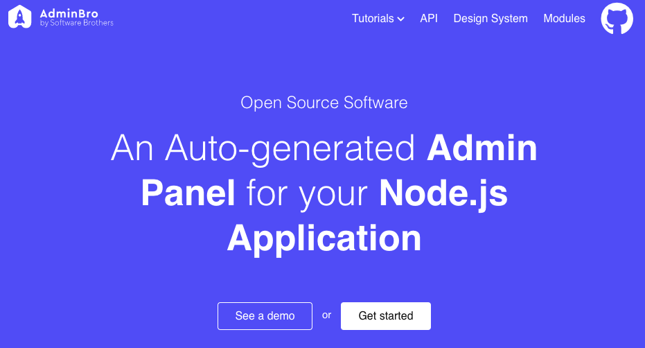

특히 Express plugin을 지원하기 때문에 Express를 기본으로 HTTP Server framework으로 사용하는 [Nest.js](https://nestjs.com/)와도 조합하여 사용할 수 있지 않을까라는 호기심으로 여러가지 설정을 해보았는데 Nest.js와도 연동하여 사용할 수 있어서 관련해서 정리할 겸 정리하는 포스팅을 쓴다.

**해당 코드는 [Github repository](https://github.com/ivvve/code-examples/tree/master/nestjs-admin-bro)에서 확인 가능하다**

---

## Nest.js와 AdminBro 연결하기

먼저 Nest.js를 AdminBro에 연결시켜 보자.

(AdminBro에서 만든 [admin-bro/nest.js module](https://adminbro.com/module-@admin-bro_nestjs.html)도 있긴하지만 아직 1.0.0 버전이기도하고 document에 있는데로 하면 오류가 나기 때문에 해당 모듈은 사용하지 않도록 하겠다)

예제는 `nestjs-admin-bro`라는 프로젝트를 만들어서 이를 기반으로 진행하겠다.

### Nest.js 애플리케이션 생성

먼저 `nestjs-admin-bro` Nest.js 프로젝트를 만든다.

```bash
# nest cli를 사용하여 프로젝트 생성
# https://docs.nestjs.com/cli/overview
$ nest new nestjs-admin-bro
```

### AdminBro 설정하기

Nest.js 프로젝트를 만들었으니 `nestjs-admin-bro` 디렉토리에서 AdminBro를 설정하자.

```bash
$ cd nestjs-admin-bro

# AdminBro 패키지 설치
$ npm i admin-bro @admin-bro/express express-formidable
```

Nest.js의 내부 웹 서버 framework는 **Express**를 사용하기 때문에
위와 같이 AdminBro Express plugin을 설치한다.

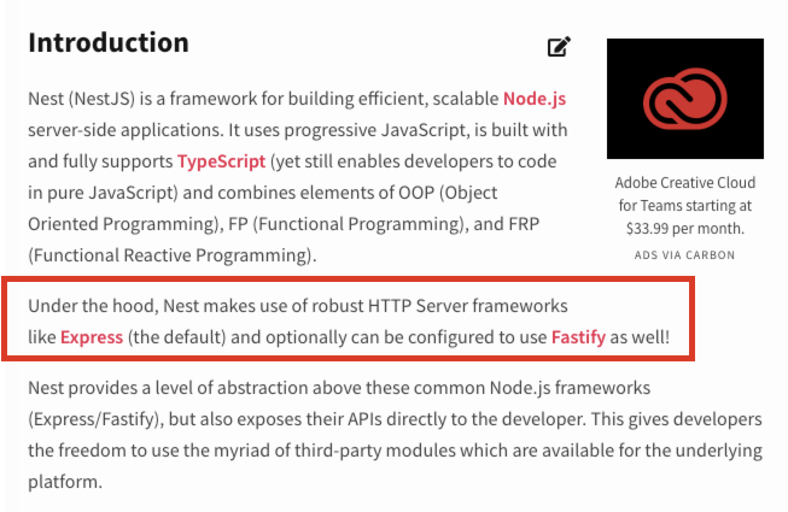

---

참고로 AdminBro는 현재 **Fastify**를 지원하지 않는다고 한다.
https://adminbro.com/module-@admin-bro_nestjs.html

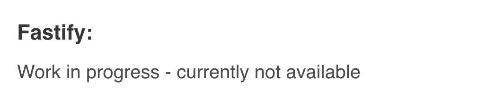

---

이제 AdminBro Admin을 실행하기 위해 다음과 같이 새로 `admin.ts` 파일을 생성한다.

```ts
// src/admin.ts

import AdminBro from 'admin-bro';
import * as AdminBroExpress from '@admin-bro/express'

import { NestFactory } from '@nestjs/core';
import { AppModule } from './app.module';

async function runAdmin() {
  // Nest.js App 생성
  const app = await NestFactory.create(AppModule);

  // AdminBro router 생성
  const adminBro = new AdminBro({
    rootPath: '/admin'
  });
  const router = AdminBroExpress.buildRouter(adminBro);

  // Nest.js AdminBro 연결
  app.use(adminBro.options.rootPath, router);

  // App 실행
  await app.listen(3000);
  console.log('Nest.js AdminBro is running on 3000')
}

runAdmin();
```

### App 실행하기

편리하게 실행하기 위해 다음과 같이 `package.json`에 `start:admin` 스크립트를 추가하자.

```json
// package.json

{
  // ...
  "scripts": {
    // ...
    "start:admin": "ts-node src/admin",
    // ...
  },
  // ...
}
```

(Admin 페이지라 **ts-node**로 간단하게 실행하도록 지정하였다.)

스크립트를 추가한 뒤 스크립트를 실행시키면 App이 실행된다.

```bash
$ npm run start:admin
> nestjs-admin-bro@0.0.1 start:admin ~/snippets/nestjs-admin-bro
> ts-node src/admin

express-session was not required
[Nest] 45686   - 09/13/2020, 10:51:28 AM   [NestFactory] Starting Nest application...
[Nest] 45686   - 09/13/2020, 10:51:28 AM   [InstanceLoader] AppModule dependencies initialized +9ms
AdminBro: bundle ready
[Nest] 45686   - 09/13/2020, 10:51:28 AM   [RoutesResolver] AppController {}: +8ms
[Nest] 45686   - 09/13/2020, 10:51:28 AM   [RouterExplorer] Mapped {, GET} route +2ms
[Nest] 45686   - 09/13/2020, 10:51:28 AM   [NestApplication] Nest application successfully started +2ms
Nest.js AdminBro is running on 3000
```

http://localhost:3000/admin 에 접속하면 다음과 같이 AdminBro가 세팅된 것을 확인할 수 있다.

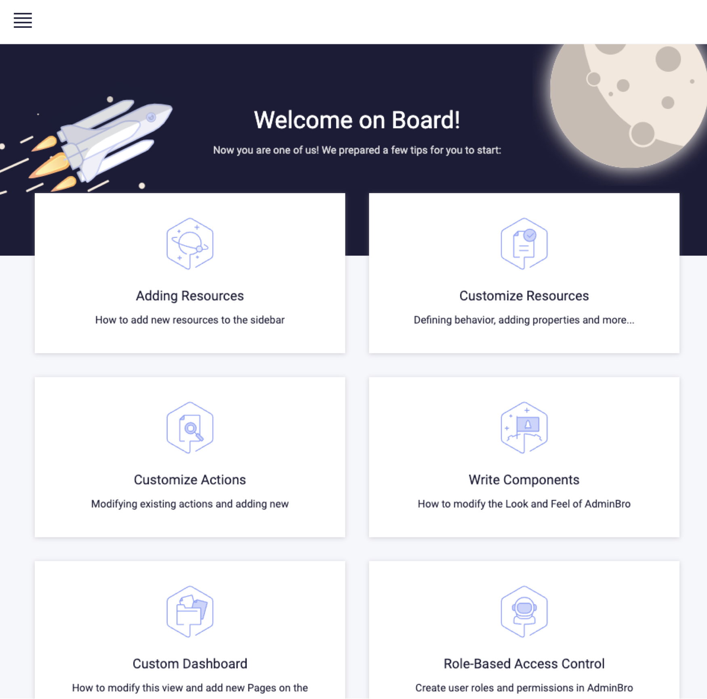

기본적인 설정은 되었고 이제 Admin에서 데이터를 관리할 수 있도록 DB 모듈과 연동시켜보자.

## Nest.js TypeORM과 AdminBro 연동하기

서비스에서 `User` 정보는 RDB에 저장하고 이를 App에서 사용할 때 `TypeORM`을 사용한다고 할 때 기존 Nest.js의 TypeORM Module을 사용하여 쉽게 AdminBro 설정을 할 수 있다.

기본적인 세팅을 위해서 다음과 같이 프로젝트 생성시에 같이 생성된 **app.controller.ts**, **app.controller.spec.ts**, **app.service.ts** 파일을 지우고 `src/user` 디렉토리를 생성한다.

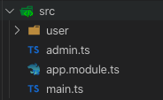

### User Module 세팅하기

Nest.js TypeORM Module을 사용하는 `User Module`을 세팅하기 위해 먼저 npm 패키지를 추가하자.

```bash
npm i @nestjs/typeorm typeorm mysql
```

그리고 User entity를 추가한다.

```ts
// src/user/user.entity.ts

import { Entity, PrimaryGeneratedColumn, Column, BaseEntity } from "typeorm";

@Entity()
export class User extends BaseEntity {
  @PrimaryGeneratedColumn('increment')
  private id: number;

  @Column({ unique: true })
  private email: string;

  @Column()
  private name: string;
}
```

그리고 User module을 만들어 Nest.js TypeORM 설정을 추가한다.

```ts
// src/user/user.module.ts

import { Module } from '@nestjs/common';
import { TypeOrmModule } from '@nestjs/typeorm';
import { User } from './user.entity';

@Module({
  imports: [
    TypeOrmModule.forRoot({
      type: 'mysql',
      host: 'localhost',
      port: 8200,
      username: 'root',
      password: 'root',
      database: 'playground',
      entities: [User],
      synchronize: true,
      logging: true
    })
  ],
  controllers: [],
  providers: [],
})
export class UserModule {}
```

(단순한 예제를 위해 서비스 코드는 세팅하지 않았다)

### AdminBro TypeORM 설정

npm 패키지에 AdminBro의 TypeORM 모듈을 추가한다.

```bash
$ npm i @admin-bro/typeorm
```

그리고 `admin.ts`에 TypeORM 설정을 추가하자.

```ts
// src/admin.ts

import AdminBro from 'admin-bro';
import * as AdminBroExpress from '@admin-bro/express'
import { Database, Resource} from '@admin-bro/typeorm'

import { NestFactory } from '@nestjs/core';
import { AppModule } from './app.module';
import { User } from './user/user.entity';

async function runAdmin() {
  // Nest.js App 생성
  const app = await NestFactory.create(AppModule);

  // AdminBro Adapter 등록
  AdminBro.registerAdapter({ Database, Resource });

  // AdminBro router 생성
  const adminBro = new AdminBro({
    resources: [
      { resource: User }
    ],
    rootPath: '/admin'
  });
  const router = AdminBroExpress.buildRouter(adminBro);

  // Nest.js AdminBro 연결
  app.use(adminBro.options.rootPath, router);

  // App 실행
  await app.listen(3000);
  console.log('Nest.js AdminBro is running on 3000')
}

runAdmin();
```

### Admin 확인

다시 앱을 실행 후 admin 페이지로 접속해보면 좌측 상단이 햄버거 버튼을 누르면 새로 `User` 리소스가 추가된 것을 확인할 수 있다.

```bash
$ npm run start:admin
```

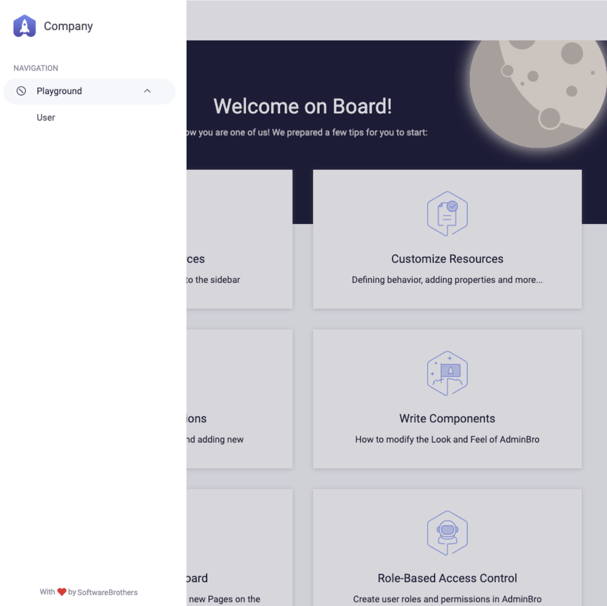

`User`를 클릭해서 들어가보면 GUI로 쉽게 데이터를 관리할 수 있게 AdminBro에서 페이지를 자동으로 만들어준다.

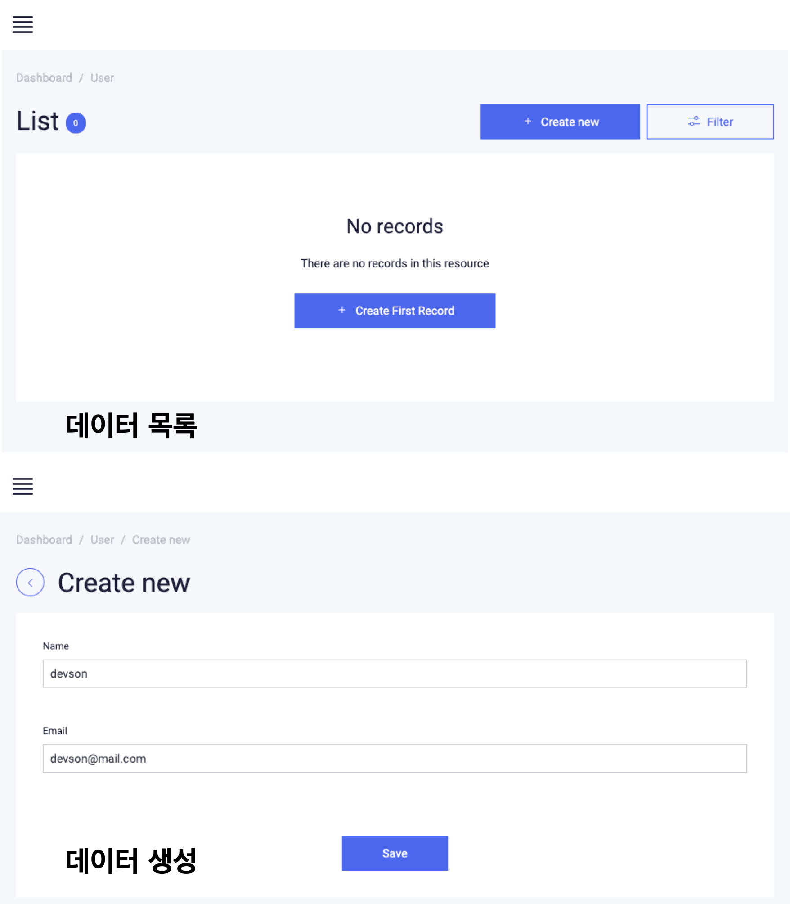

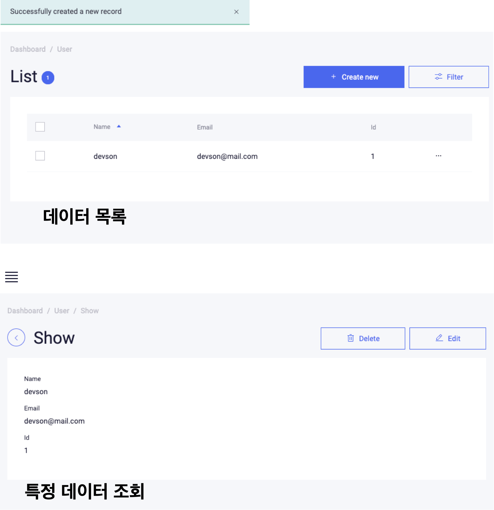

지금까지 AdminBro에 TypeORM을 연동하는 것을 살펴봤다.


## Nest.js Mongoose와 AdminBro 연동하기

모듈을 도메인 기준으로 나누고 polyglot persistence를 적용한다면 다른 도메인 기능에는 다른 형태의 Database를 적용하는 것을 고려할 수 있을 것이다.

여러 도메인 모듈들의 다양한 Database를 하나의 어드민 페이지에서 관리하고 싶은 경우를 예로 들기 위해 새로운 모듈은 Mongoose를 사용하도록 하겠다.

### Board Module 세팅하기

`Board Module` 생성을 위해 다음과 같이 먼저 `board` 디렉토리를 만들도록 한다.

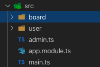

그리고 Nest.js Mongoose Module을 사용하기 위해 npm 패키지를 추가하자

```bash
$ npm i mongoose @nestjs/mongoose @typegoose/typegoose
$ npm i -D @types/mongoose
```

그리고 Board entity를 추가한다.

```ts
// src/board/board.entity.ts

import { buildSchema, prop } from "@typegoose/typegoose";

export class Board {
  @prop()
  private title: string;

  @prop()
  private content: string;
}

export const BoardSchema = buildSchema(Board);
```

그 다음 Board module을 만들어 Nest.js Mongoose 설정을 추가한다.

```ts
import { Module } from "@nestjs/common";
import { MongooseModule } from "@nestjs/mongoose";
import { BoardSchema } from './board.entity';
import { mongoose } from "@typegoose/typegoose";

@Module({
  imports: [
    MongooseModule.forRoot('mongodb://127.0.0.1:8100/playground', {
      useCreateIndex: true,
      useNewUrlParser: true,
      useUnifiedTopology: true
    }),
    MongooseModule.forFeature([
      { name: 'Board', collection: 'boards', schema: BoardSchema } // name 확인!
    ])
  ],
  exports: [MongooseModule]
})
export class BoardModule {}

mongoose.set('debug', true);
```

(단순한 예제를 위해 서비스 코드는 세팅하지 않았다)

위에서 **MongooseModule.forFeature**에서 설정한 Board entity의 `name` 속성을 확인하자.
Nest.js는 Mongoose Model을 container에 저장할 때 `${name}Model`을 이름으로 저장한다.
그렇기 때문에 위에서 지정한 `Board` Mongoose Model을 Nest.js container에서 가져올 때는 `BoardModel`로 가져오면 된다.

### AdminBro Mongoose 설정

npm 패키지에 AdminBro의 Mongoose 모듈을 추가한다.

```bash
$ npm i @admin-bro/mongoose
```

그리고 admin.ts에 Mongoose 설정을 추가하자.

```ts
import AdminBro from 'admin-bro';
import * as AdminBroExpress from '@admin-bro/express';
import { Database, Resource} from '@admin-bro/typeorm';
import * as AdminBroMongoose from '@admin-bro/mongoose';

import { NestFactory } from '@nestjs/core';
import { AppModule } from './app.module';
import { User } from './user/user.entity';

async function runAdmin() {
  // Nest.js App 생성
  const app = await NestFactory.create(AppModule);

  // AdminBro Adapter 등록
  AdminBro.registerAdapter({ Database, Resource })
  AdminBro.registerAdapter(AdminBroMongoose);

  // Mongoose Model
  const boardModel = app.get('BoardModel'); // Model 명 확인!

  // AdminBro router 생성
  const adminBro = new AdminBro({
    resources: [
      { resource: User },
      { resource: boardModel }
    ],
    rootPath: '/admin'
  });
  const router = AdminBroExpress.buildRouter(adminBro);

  // Nest.js AdminBro 연결
  app.use(adminBro.options.rootPath, router);

  // App 실행
  await app.listen(3000);
  console.log('Nest.js AdminBro is running on 3000')
}

runAdmin();
```

위 코드에서 Board Mongoose Model을 가져오기 위해서 Nest.js container에서 `BoardModel`이라는 이름으로 가져왔다.

```ts
const boardModel = app.get('BoardModel');
```

### Admin 확인

앱을 다시 실행 후 admin에 접속하면 `Board`라는 새로운 리소스가 추가된 것을 확인할 수 있다.

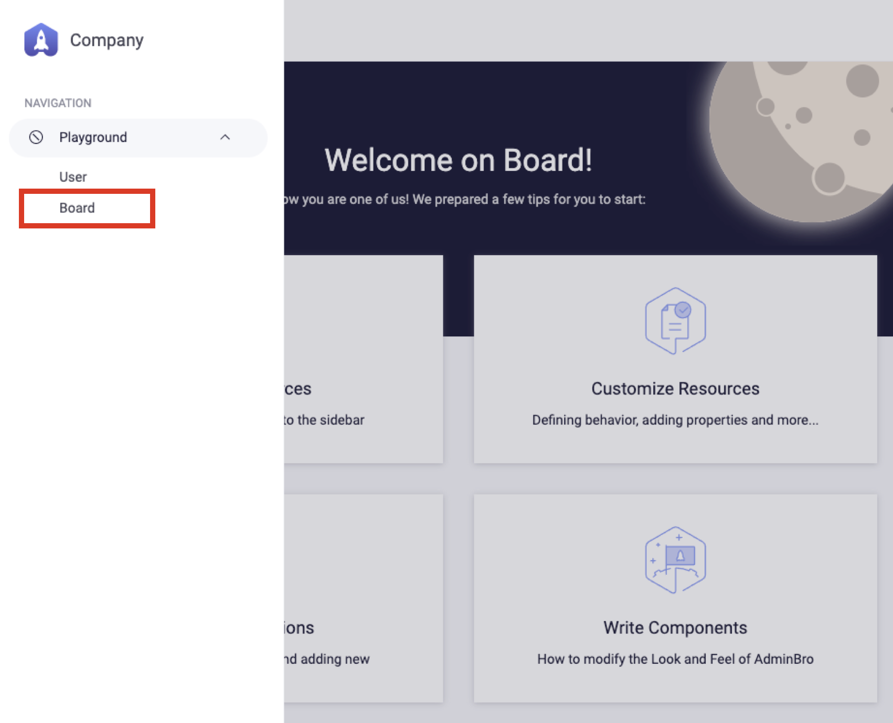

**Playground** 하위에 추가된 것은 TypeORM에 사용한 RDB DB와 Mongoose에 사용한 MongoDB DB가 동일하기 때문이다.
다른 DB명을 사용하면 서로 분리된다.

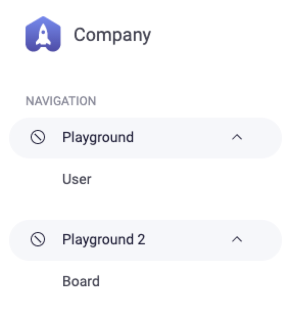

새로 추가된 Board도 GUI를 통해 쉽게 데이터를 관리할 수 있다.

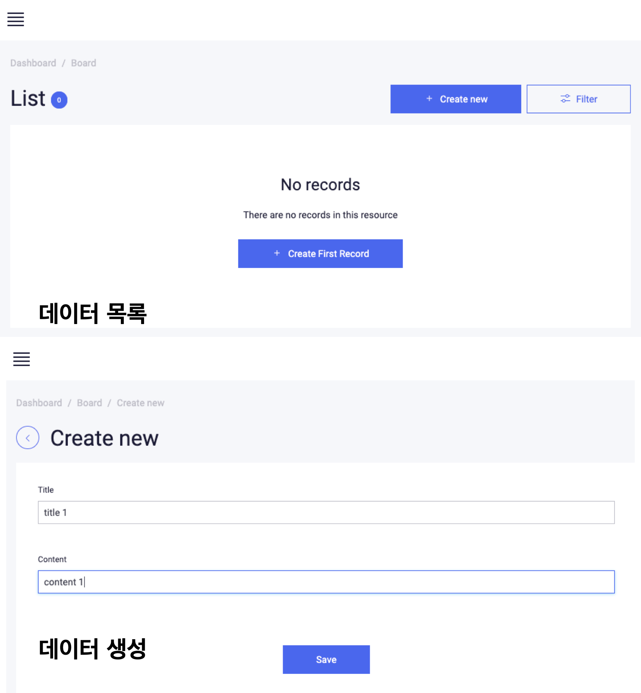

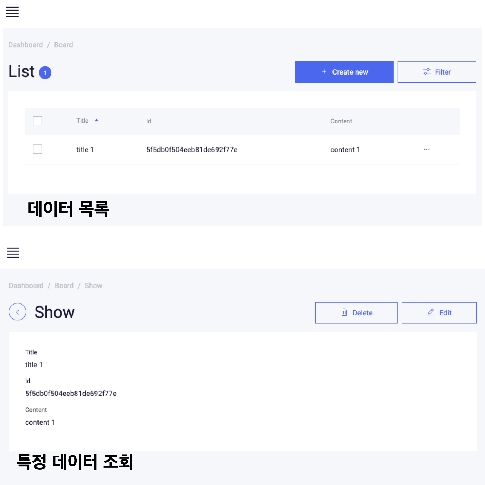
